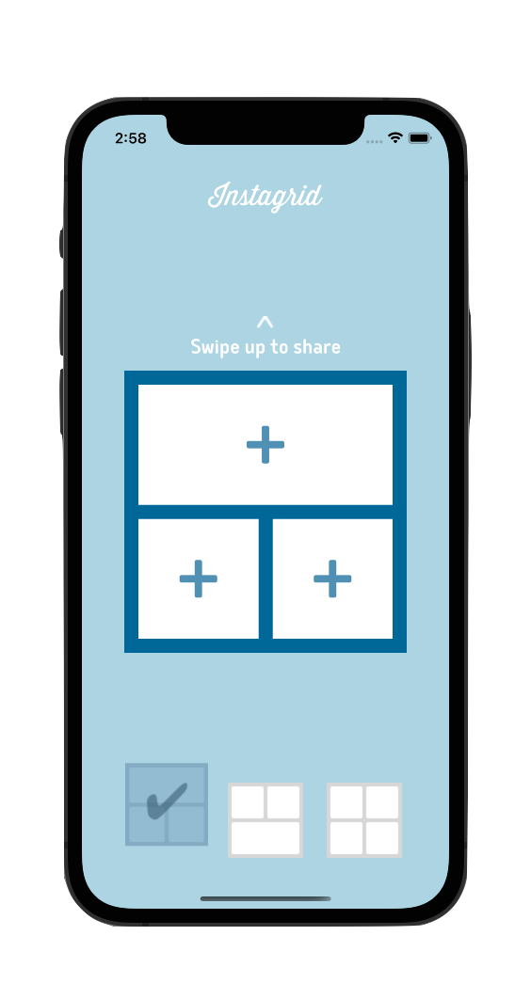

# Instagrid

    
    

    Instagrid is the second coded protect of my training at OpenClassRooms. 
    If you wanna see the others, checkout my <a href="https://github.com/imick666/OpenClassRooms"> dedicated repo</a>
    

## Sommary
- [Introduction](#introduction)
- [Description](#description)
- [What I Learned](#what-i-learned)
- [Screenshots](#screenshots)

## Introduction

In this project, I discovered the MVC pattern en the storyBoard. I had to realize I photo montage app for iOS 13 and higher.

## Description

Instagrid is a photo montage app where the user can insert an image in a predifiened grid from:

- the photo library 
- the cameras (front or back)

Then, the user can :
- share the montage trhough message, email, etc
- post it on his favorite socail network
- save it in his library

## What I learned

- MVC Design patern
- Storyboard
- UIKit
- ImagePicker
- Adapt UI with device orientation
- UIActivityViewController
- Use custom fonts
- Privacy sensitive data
- Animations
- Gestures

## Screenshots

